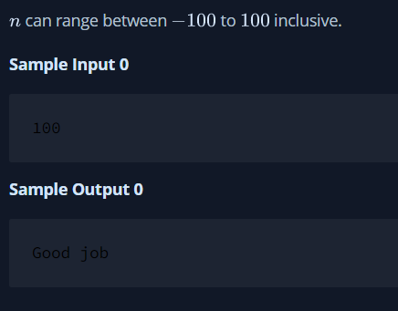
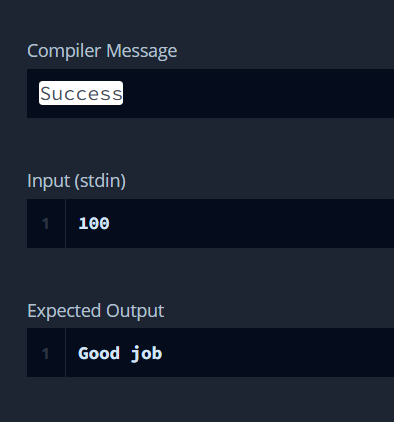

# Java Int to String
You are given an integer n , you have to convert it into a string.

Please complete the partially completed code in the editor. If your code successfully converts n into a string s the code will print "Good job". Otherwise it will print "Wrong answer".

## Output

