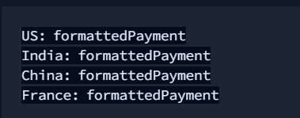
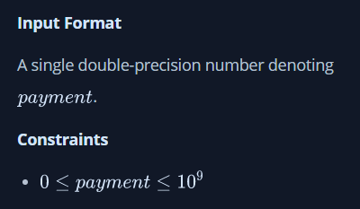
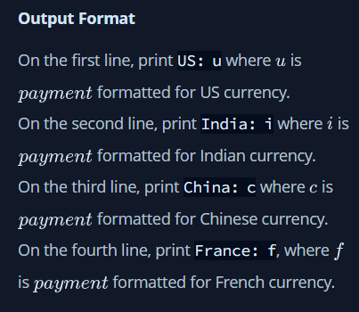
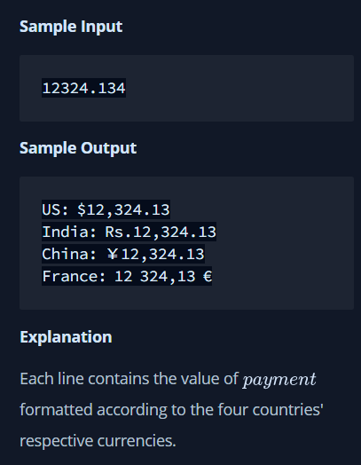

#Java Currency Formatter
Given a double-precision number,Payment, denoting an amount of money, use the NumberFormat class' getCurrencyInstance method to convert Payment into the US, Indian, Chinese, and French currency formats. Then print the formatted values as follows:

where FormatedPayment is Payment formatted according to the appropriate Locale's currency.

Note: India does not have a built-in Locale, so you must construct one where the language is en (i.e., English).

