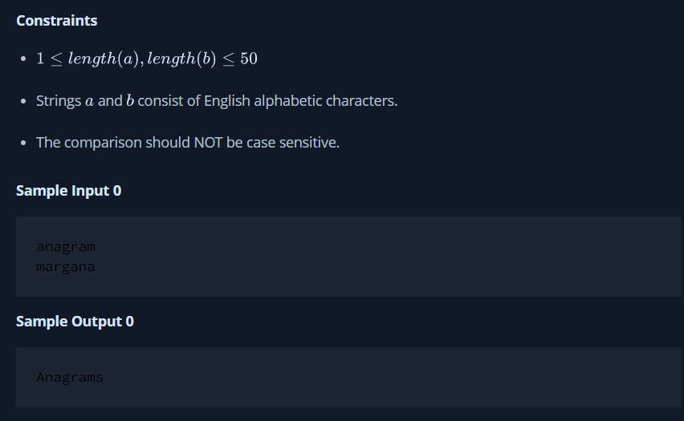
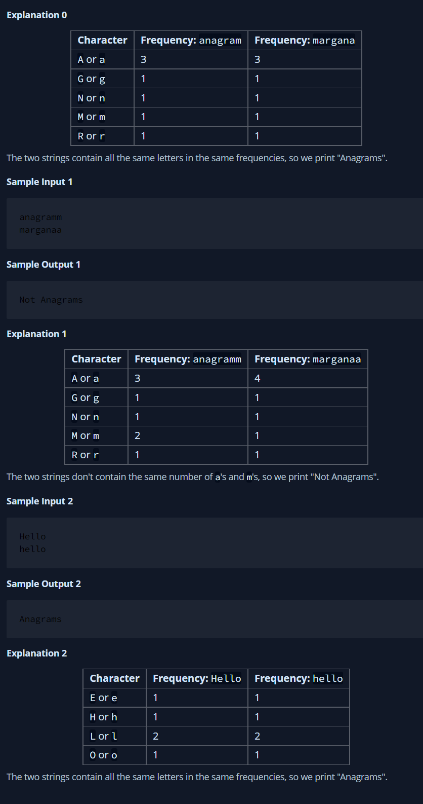
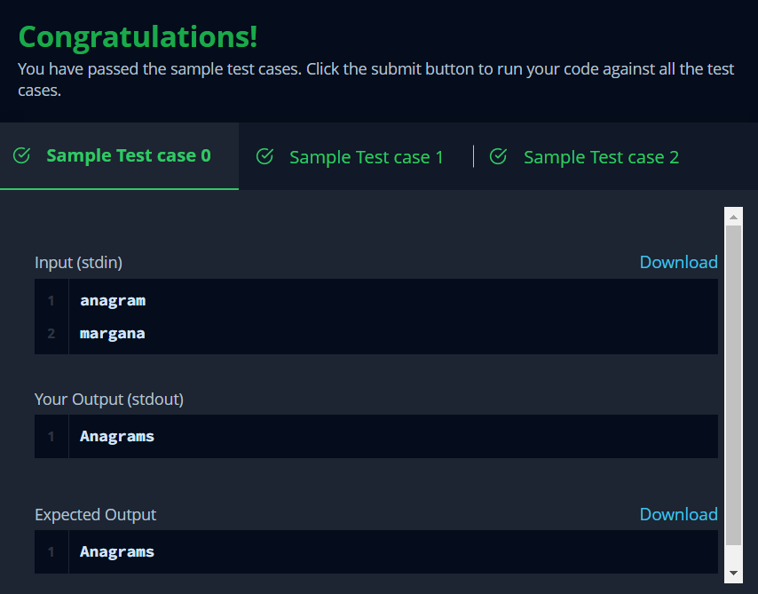

# Java Anagrams

Two strings, a and b, are called anagrams if they contain all the same characters in the same frequencies. For this challenge, the test is not case-sensitive. For example, the anagrams of CAT are CAT, ACT, tac, TCA, aTC, and CtA.

#### Function Description

Complete the isAnagram function in the editor.

isAnagram has the following parameters:

string a: the first string

string b: the second string
#### Returns

boolean: If  and  are case-insensitive anagrams, return true. Otherwise, return false.
#### Input Format

The first line contains a string .

The second line contains a string .

