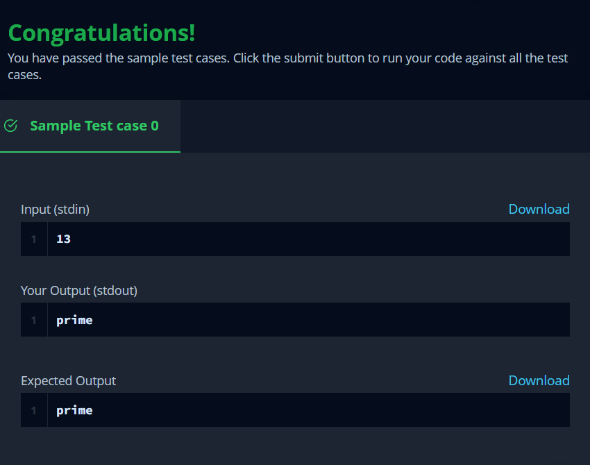

#Java Primality Test

A prime number is a natural number greater than 1 whose only positive divisors are  and itself. For example, the first six prime numbers are 2, 3, 5, 7, 11 and 13.

Given a large integer, n, use the Java BigInteger class' isProbablePrime method to determine and print whether it's prime or not prime.

#### Sample Input

13

#### Sample Output

prime

#### Explanation

The only positive divisors of 13 are 1 and 13, so we print prime.

