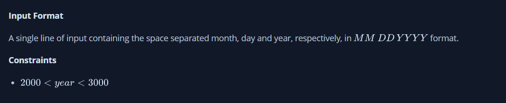

# Java Date and Time

The Calendar class is an abstract class that provides methods for converting between a specific instant in time and a set of calendar fields such as YEAR, MONTH, DAY_OF_MONTH, HOUR, and so on, and for manipulating the calendar fields, such as getting the date of the next week.

You are given a date. You just need to write the method, DAY , which returns the day on that date. To simplify your task, we have provided a portion of the code in the editor.

### Function Description

Complete the findDay function in the editor below.

### findDay has the following parameters:

int: month
int: day
int: year
Returns

### string: 
the day of the week in capital letters

